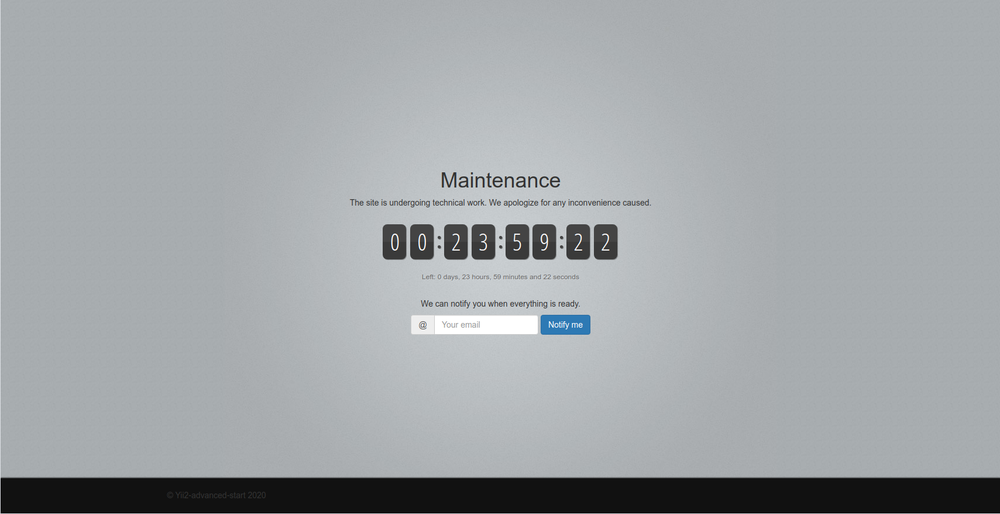
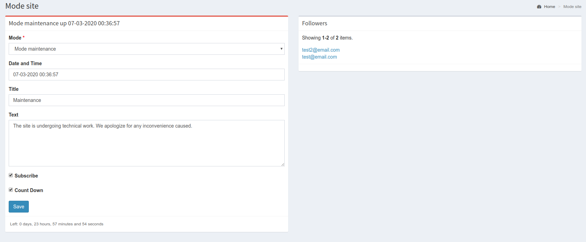

Maintenance mode for a site running on Yii2
===========================================

Switching the site on Yii2 to maintenance mode with a timer, a subscription form, and sending notifications to users,
when the site goes into normal mode.

What it looks like
-------------------
Maintenance Mode

Maintenance mode managering

Management of the regime is also carried out using console commands.

Connection and setup
--------------------
* [For Basic template](basic/README.md)
* [For Advanced template](advanced/README.md)