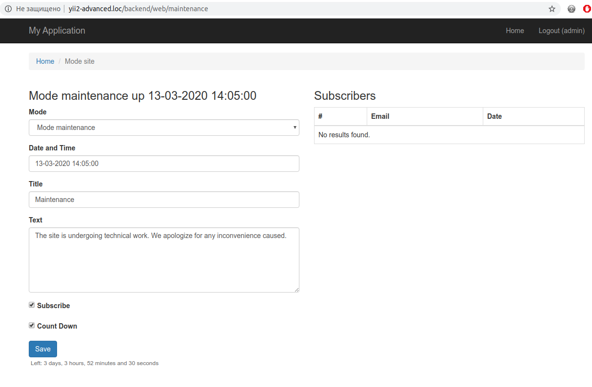

Connection and setup
====================

Connecting and configure for the newly installed [yii2-app-advanced](https://github.com/yiisoft/yii2-app-advanced) advanced template.

common/config/main.php
```php
<?php

use dominus77\maintenance\states\FileState;
use dominus77\maintenance\interfaces\StateInterface;

$params = array_merge(
    require __DIR__ . '/params.php',
    require __DIR__ . '/params-local.php'
);

return [   
    //...
    'container' => [
        'singletons' => [
            StateInterface::class => [
                'class' => FileState::class,
                'directory' => '@frontend/runtime',
                // Configure templates for subscribers
                'subscribeOptions' => [
                    'template' => [
                        'html' => '@dominus77/maintenance/mail/emailNotice-html',
                        'text' => '@dominus77/maintenance/mail/emailNotice-text'
                    ]                                                          
                ]
            ]
        ]
    ],
    //...
];
```
common/config/params.php
```php
<?php

return [
    //...
    'frontendUrl' => 'http://yii2-advanced.loc'
];
```
frontend/config/main.php
```php
<?php

use dominus77\maintenance\filters\UserFilter;
use dominus77\maintenance\controllers\frontend\MaintenanceController;
use dominus77\maintenance\states\FileState;
use dominus77\maintenance\interfaces\StateInterface;
use dominus77\maintenance\filters\URIFilter;
use dominus77\maintenance\Maintenance;

//...

return [
    //...
    'language' => 'en',
    //...
    'bootstrap' => [
        //...
        Maintenance::class
    ],    
    'container' => [
        'singletons' => [
            Maintenance::class => [
                'class' => Maintenance::class,                
                'route' => 'maintenance/index',                
                'filters' => [
                    // routes for which to ignore mode
                    [
                        'class' => URIFilter::class,
                        'uri' => [
                            'debug/default/view',
                            'debug/default/toolbar',
                            'site/login',
                            'site/logout',
                            'site/request-password-reset',
                            'site/resend-verification-email'
                        ]
                    ],
                    // Users for whom to ignore mode
                    [
                        'class' => UserFilter::class,
                        'checkedAttribute' => 'username',
                        'users' => ['admin']
                    ]
                ],
            ],
            StateInterface::class => [
                'class' => FileState::class,
                'directory' => '@runtime'
            ]
        ]
    ],    
    'controllerMap' => [
        //...
        'maintenance' => [
            'class' => MaintenanceController::class
        ],
    ],
    //...
];
```
backend/config/main.php
```php
<?php

use dominus77\maintenance\BackendMaintenance;
use dominus77\maintenance\controllers\backend\MaintenanceController;

//...

return [
    //...
    'language' => 'en',
    //...
    'bootstrap' => [        
        BackendMaintenance::class
    ],
    //...
    'controllerMap' => [
        'maintenance' => [
            'class' => MaintenanceController::class,
            'roles' => ['@'] // Authorized User
        ],
    ],
    //...
];
```
console/config/main.php
```php
<?php

use dominus77\maintenance\commands\MaintenanceController;
use dominus77\maintenance\states\FileState;
use dominus77\maintenance\interfaces\StateInterface;
use dominus77\maintenance\BackendMaintenance;

//...

return [
    //...
    'language' => 'en',
    //...    
    'bootstrap' => [
        //...
        BackendMaintenance::class
    ],
    //...
    'container' => [
        'singletons' => [
            StateInterface::class => [
                'class' => FileState::class,
                'directory' => '@frontend/runtime',
            ]
        ]
    ],
    'controllerMap' => [
        //...
        'maintenance' => [
            'class' => MaintenanceController::class,
        ],
    ],
    'components' => [
        //...
        'urlManager' => [
            'hostInfo' => $params['frontendUrl'], // http://yii2-advanced.loc
            //...
        ]
    ],
    //...
];
```

New console commands:

| Command                         | Description                             |
|:------------------------------- |:--------------------------------------- |
| `php yii maintenance`           | Mode status                             |
| `php yii maintenance/enable`    | Enable mode                             |
| `php yii maintenance/update`    | Editing mode                            |
| `php yii maintenance/followers` | Alert Subscribers                       |
| `php yii maintenance/disable`   | Turn off the mode and send alerts       |

The following options are available for `enable` and `update`:

| Option      | Alias | Description                                         |
|:----------- |:----- |:--------------------------------------------------- |
| --date      |  -d   | Set/Change Maintenance End Date                     |
| --title     |  -t   | Set/Change the title on the page                    |
| --content   |  -c   | Set/Change the main content on the page             |
| --subscribe |  -s   | Show/Hide the subscription form on the page         |
| --timer     |  -tm  | Show/Hide the timer on page                         | 

Example:
```
php yii maintenance/enable -d="07-03-2020 18:00:00" -s=true -tm=true
php yii maintenance/update -t="Maintenance"
php yii maintenance/update -c="The site is undergoing technical work. We apologize for any inconvenience caused."
```
Link to the admin interface web interface `http://yii2-advanced.loc/backend/web/maintenance/index`

