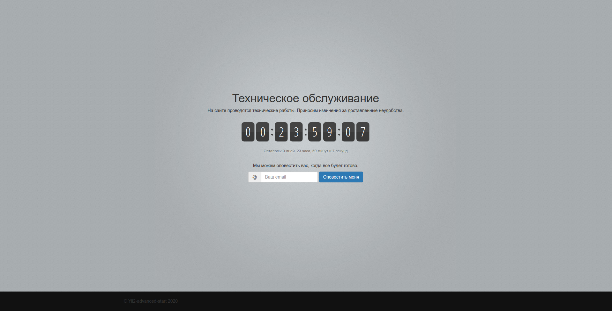
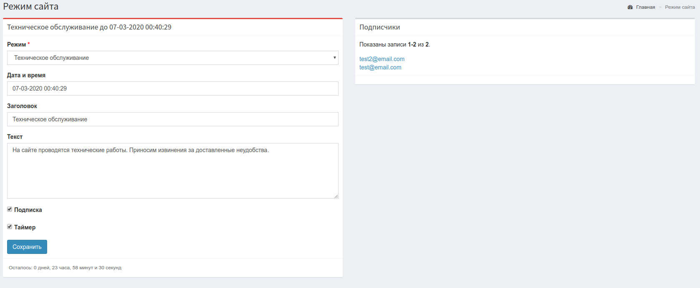

Режим обслуживания для сайта работающего на Yii2
================================================

Переключение сайта на Yii2 в режим обслуживания с таймером, формой подписки, и отправкой уведомлений пользователям,
при переходе сайта в нормальный режим.

Как выглядит
------------
Режим технического обслуживания

Управление режимом

Управление режимом, так же осуществляется с помощью консольных команд.

Подключение и настройка
-----------------------
* [Для базового шаблона Basic](basic/README.md)
* [Для расширенного шаблона Advanced](advanced/README.md)