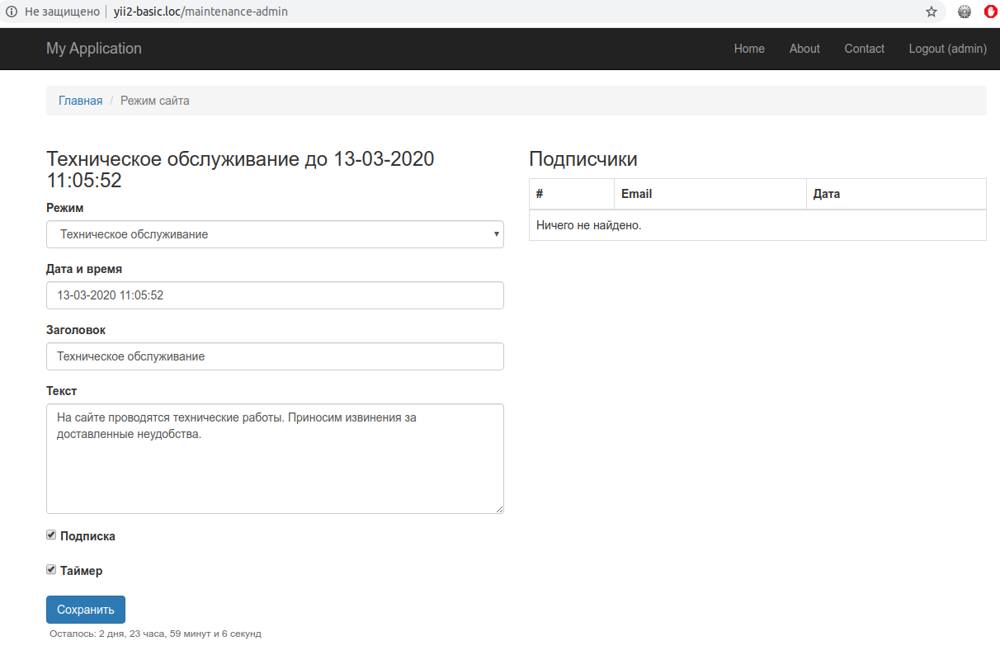

Подключение и настройка
=======================

Подключение и настройка на только что установленном [базовом шаблоне](https://github.com/yiisoft/yii2-app-basic).

app/config/web.php
```php
<?php

use dominus77\maintenance\Maintenance;
use dominus77\maintenance\interfaces\StateInterface;
use dominus77\maintenance\states\FileState;
use dominus77\maintenance\filters\URIFilter;
use dominus77\maintenance\filters\UserFilter;
use dominus77\maintenance\controllers\frontend\MaintenanceController;
use dominus77\maintenance\controllers\backend\MaintenanceController as BackendMaintenanceController;

//...

$config = [
    //...
    'language' => 'ru',
    //...
    'bootstrap' => [
        //...      
        Maintenance::class
    ],
    //...
    'container' => [
        'singletons' => [
            Maintenance::class => [
                'class' => Maintenance::class,
                'route' => 'maintenance/index',
                'filters' => [
                    // роуты для которых игнорировать режим
                    [
                        'class' => URIFilter::class,
                        'uri' => [                            
                            'site/login',
                            'site/logout'
                        ]
                    ],
                    // Пользователи для которых игнорировать режим
                    [
                        'class' => UserFilter::class,
                        'checkedAttribute' => 'username',
                        'users' => ['admin']
                    ]
                ],
            ],
            StateInterface::class => [
                'class' => FileState::class,
                'subscribeOptions' => [                    
                    'template' => [
                        'html' => '@dominus77/maintenance/mail/emailNotice-html'
                    ]
                ],
                'directory' => '@runtime',
            ]
        ]
    ],    
    'controllerMap' => [
        //...
        'maintenance' => [
            'class' => MaintenanceController::class,            
        ],
        'maintenance-admin' => [
            'class' => BackendMaintenanceController::class,                       
            'roles' => ['@'] // Авторизованный пользователь
        ],
    ],
    //...
];
```
app/config/params.php
```php
<?php

return [
    //...
    'frontendUrl' => 'http://yii2-basic.loc',
];
```
app/config/console.php
```php
<?php

use dominus77\maintenance\BackendMaintenance;
use dominus77\maintenance\interfaces\StateInterface;
use dominus77\maintenance\states\FileState;
use dominus77\maintenance\commands\MaintenanceController;

//...

$config = [
    //...
    'language' => 'ru',
    //...
    'bootstrap' => [
        //...
        BackendMaintenance::class
    ],    
    'container' => [
        'singletons' => [
            StateInterface::class => [
                'class' => FileState::class,
                'subscribeOptions' => [                    
                    'template' => [
                        'html' => '@dominus77/maintenance/mail/emailNotice-html'
                    ]
                ],
                'directory' => '@runtime',
            ]
        ]
    ],    
    'controllerMap' => [
        //...
        'maintenance' => [
            'class' => MaintenanceController::class,
        ]
    ],    
    'components' => [
        //..        
        'urlManager' => [
            'hostInfo' => $params['frontendUrl'], // http://yii2-basic.loc
            //...
        ],
    ],
    //...
];
```

Теперь доступны консольные команды

| Команда                         | Описание                                |
|:------------------------------- |:--------------------------------------- |
| `php yii maintenance`           | Статус режима                           |
| `php yii maintenance/enable`    | Включение режима                        |
| `php yii maintenance/update`    | Редактирование режима                   |
| `php yii maintenance/followers` | Подписчики на оповещение                |
| `php yii maintenance/disable`   | Отключение режима и отправка оповещений |

Для `enable` и `update` доступны следующие опции:

| Опция       | Алиас | Описание                                            |
|:----------- |:----- |:--------------------------------------------------- |
| --date      |  -d   | Установка/Изменение даты окончания тех.обслуживания |
| --title     |  -t   | Установка/Изменение заголовка на странице           |
| --content   |  -c   | Установка/Изменение основного контента на странице  |
| --subscribe |  -s   | Отображать/Не отображать форму подписки на странице |
| --timer     |  -tm  | Отображать/Не отображать таймер на странице         | 

Пример:
```
php yii maintenance/enable -d="07-03-2020 18:00:00"
```
Ссылка на вэб интерфейс админки `http://yii2-basic.loc/maintenance-admin/index`

